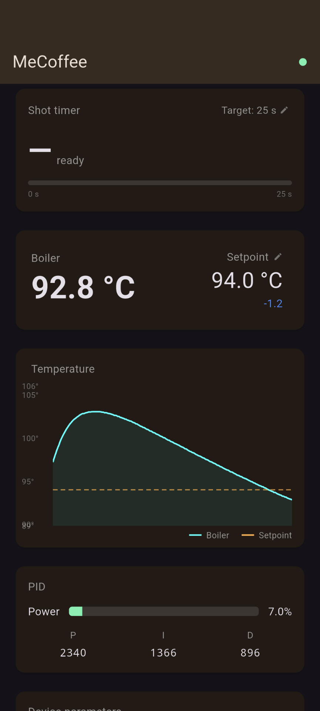

# MeCoffee

Open-source app for the [MeCoffee PID controller](https://mecoffee.nl/mebarista/) on the Rancilio Silvia — Flutter (Android/iOS) + Python terminal client.

The original meBarista app is no longer maintained. This project replaces it with a modern, open-source alternative that connects over BLE and exposes the full parameter set of the MeCoffee PID kit.



---

## Features

### Shot timer
A shot timer is always visible at the top of the screen. Set a target time (e.g. 25 s) and the timer counts up as soon as you start pulling a shot. When the target is reached the phone vibrates with two strong pulses so you know to stop — even if the phone is on the counter. The last shot duration is shown after the shot ends.

### Temperature control
Tap the setpoint on the main screen to adjust the brew temperature. A bottom sheet opens with **−1**, **−½**, **+½**, **+1 °C** step buttons so you can dial in your temperature precisely. The steam setpoint is adjustable the same way from the parameters section.

### PID tuning
The P, I and D values can be edited directly from the app. Tap any PID parameter to enter a new value — changes are sent to the device immediately over BLE.

### Live dashboard
- Boiler temperature and setpoint with colour-coded offset indicator
- Scrolling temperature chart (boiler vs setpoint)
- PID power bar showing heater output percentage
- Full device parameter list

### Auto-reconnect
The app scans for the MeCoffee device on launch and reconnects automatically if the connection drops.

---

## Repository layout

```
mecoffee/
├── app/        Flutter app (Android + iOS)
└── python/     Terminal dashboard (macOS / Linux)
```

---

## Flutter app

### Requirements

- Flutter 3.x
- Android 6+ or iOS 12+
- A Rancilio Silvia with the MeCoffee PID kit installed

> **Tested on:** Pixel 7 (Android). iOS support is implemented but not yet tested on real hardware.

### Run

```bash
cd app
flutter pub get
flutter run
```

The app scans for a BLE device whose name starts with `meCoffee`, connects automatically, and reconnects if the connection drops.

### Permissions

Android permissions are declared in `AndroidManifest.xml`:
- `BLUETOOTH_SCAN` (never for location)
- `BLUETOOTH_CONNECT`

No location permission is required on Android 12+.

---

## Python terminal client

### Requirements

- Python 3.10+
- A BLE adapter (built-in on most laptops)

### Setup

```bash
cd python
python3 -m venv .venv
source .venv/bin/activate
pip install -r requirements.txt
```

### Run

```bash
python dashboard.py
```

The dashboard auto-discovers the MeCoffee device, displays live temperature, PID output, and device parameters, and lets you edit settings interactively.

---

## Protocol notes

The MeCoffee PID uses an HM-10 BLE UART module:

| UUID | Role |
|------|------|
| `0000ffe0-…` | Service |
| `0000ffe1-…` | Characteristic — notify + write-without-response |

Data is plain ASCII, `\r\n`-delimited. Commands **must** be prefixed with `\n` to flush the device's UART parser, e.g. `\ncmd dump OK\r\n`.

See [`app/lib/protocol.dart`](app/lib/protocol.dart) and [`python/protocol.py`](python/protocol.py) for the full parser and command builder.

---

## Download

Pre-built APKs are available on the [Releases](https://github.com/SamuelEiler/memecoffee/releases) page.

To install: download the APK, enable *Install from unknown sources* in Android settings, and open the file.

## Contributing

Pull requests are welcome. Open an issue to discuss larger changes first.

---

## License

MIT
